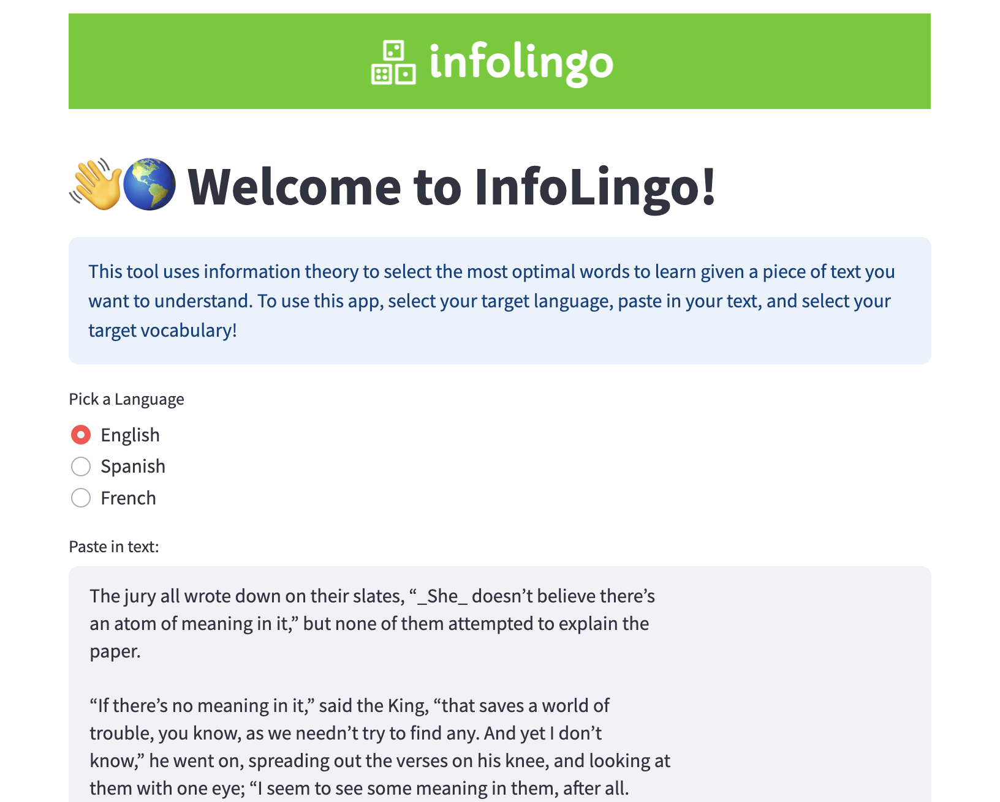

# InfoLingo: An Information Theoretic Approach to Language Learning

InfoLingo optimizes the following new words to learn in a foreign language based on the texts you are interested in! You can find the demo here.

